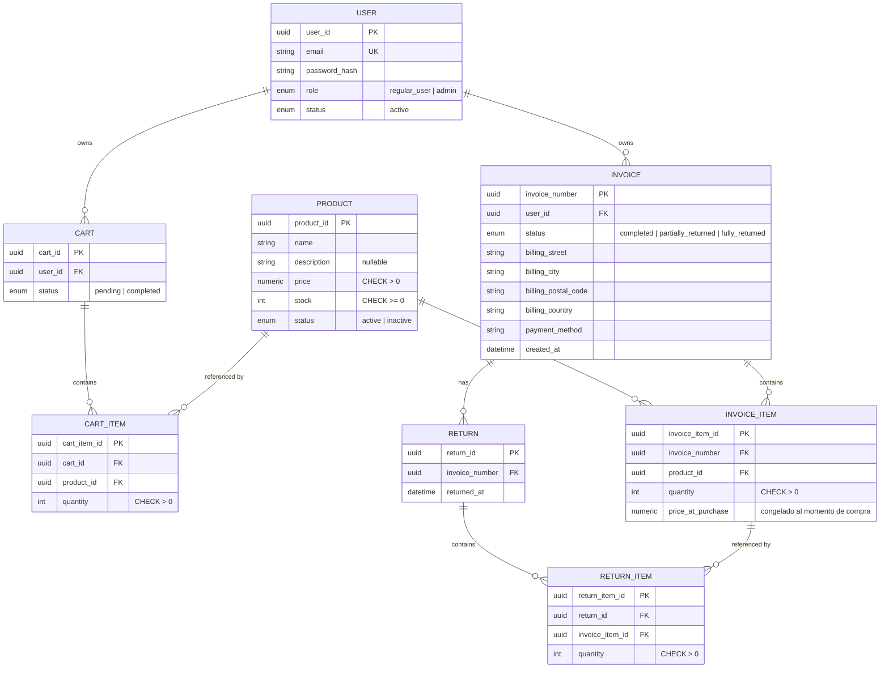

# E-commerce de Mascotas

Backend en Flask para un e-commerce de productos para mascotas: autenticación con JWT (RS256), catalogo de productos con cacheo en Redis, y ventas (carritos, checkout, facturas y devoluciones) sobre PostgreSQL.

## Stack

- Flask + SQLAlchemy, sobre PostgreSQL
- Redis como cache
- PyJWT + `cryptography` para JWT firmado con RS256
- bcrypt para hashing de passwords
- Pydantic para validación de entrada
- pytest para tests

## Setup

1. Crear y activar un entorno virtual, e instalar dependencias:

   ```
   python -m venv .venv
   .venv\Scripts\activate      # Windows
   pip install -r requirements.txt
   ```

2. Levantar PostgreSQL y Redis. La forma mas rapida es con Docker:

   ```
   docker run -d --name pets-postgres -e POSTGRES_USER=postgres -e POSTGRES_PASSWORD=postgres -e POSTGRES_DB=ecommerce_mascotas -p 5432:5432 postgres:16-alpine
   docker run -d --name pets-redis -p 6379:6379 redis:7-alpine
   ```

   Tambien sirve cualquier instalacion local de PostgreSQL o Redis — solo hace falta que los valores de conexion coincidan con el `.env` del paso siguiente.

3. Copiar `.env.example` a `.env` y completar los valores reales (conexión a PostgreSQL, Redis, rutas de las claves JWT).

4. Generar el par de claves RS256 (ver seccion siguiente).

5. Levantar la app:

   ```
   python src/run.py
   ```

   Las tablas se crean automaticamente al arrancar (`Base.metadata.create_all()` en el application factory) — no hay que correr ninguna migración a mano. Aparte que no implemente Alembic.

## Generar las claves RS256

Las claves de firma del JWT (`private.pem` / `public.pem`) se generan localmente con OpenSSL y no se deben commitear (excluidas en `src/keys/.gitignore`). Cada quien las genera una vez en su propio entorno:

```
openssl genrsa -out src/keys/private.pem 2048
openssl rsa -in src/keys/private.pem -pubout -out src/keys/public.pem
```

Las rutas a ambos archivos se leen desde `.env` (`JWT_PRIVATE_KEY_PATH`, `JWT_PUBLIC_KEY_PATH`), no estan hardcodeadas.

## Diagrama Entidad-Relación



User -> Cart | 1:N 
Un usuario puede tener 0 o varios carritos. Cada carrito tiene exactamente 1 user_id

User -> Invoice | 1:N
Un usuario puede tener 0 o varias facturas. Cada factura tiene exactamente 1 user_id

Cart -> CartItem | 1:N
Un carrito tiene - o varios items. Cada item pertenece a exactamente 1 car_id

Product -> CartItem | 1:N
Un producto puede estar en 0 o varias lineas de un carrito. Cada linea referencia exactamente a 1 product_id

Product -> InvoiceItem | 1:N
Un producto puede estar en 0 o varias lineas de una factura. Cada linea referencia exactamente a 1 invoice_item_id

Invoice -> InvoiceItem | 1:N
Una factura tiene 1 o varios items. Cada item pertenece a exactamente a 1 invoice_number

Invoice -> Return | 1:N
Una factura puede tener 0 o varias devoluciones. Cada devolucion referencia exactamente a 1 invoice_number

Return -> ReturnItem | 1:N
Una devolucion tine 1 o varios items devueltos. Cada item pertenece exactamente a 1 invoice_item_id

InvoiceItem -> ReturnItem | 1:N
Una linea de factura puede devolverse en 0 o varias devoluciones distintas(parciales). Cada ReturnItem referencia exactamente a 1 invoice_item_id

**NOTA:** Conceptualmente Cart<->Product e Invoice<->Product parecen relaciones N:N (un carrito tiene muchos productos, un producto esta en muchos carritos"), pero no estan modeladas como N:N.
CartItem e InvoiceItem no son tablas puente vacias, son entidades propias con sus propios atributos (quantity, y en el caso de InvoiceItem tambien price_at_purchase, que es la copia congelada del precio). Por eso el diagrama las resuelve como dos relaciones 1:N cada una (Cart->CartItem y Product->CartItem), no como una sola N:N directa entre Cart y Product.


## Justificación de decisiones tecnicas

**UUID en vez de enteros autoincrementales**
Todos los identificadores (`user_id`, `product_id`, `cart_id`, `invoice_number`, etc.) son UUID. Un ID secuencial es adivinable (`/products/42`, `/products/43`...) y permite enumerar recursos del sistema, mientras que un UUID no.

**Soft delete en Productos, no borrado fisico**
`DELETE /products/{id}` marca `status = inactive`, nunca borra la fila. Un producto ya vendido sigue referenciado por `product_id` desde `cart_items` e `invoice_items`; borrarlo fisicamente romperia esa integridad referencial y perdería el detalle de facturas historicas. Un admin puede seguir viendo el detalle de un producto `inactive`, pero para un cliente regular se comporta como si no existiera (404).

**RS256 para JWT, no HS256**
RS256 firma con una clave privada y verifica con la pública, lo que separa quién puede emitir tokens (solo el endpoint de login, que tiene la privada) de quién puede verificar tokens (el middleware de autenticacion, que solo necesita la publica). Con HS256 el mismo secreto firma y verifica, así que cualquier componente capaz de validar un token también sería capaz de fabricar uno. Aparte que solo he utilizado RS256 hasta el momento.

**Cacheo con Redis — que si, que no, y por que**

| Endpoint | Cache | TTL | Motivo |
|---|---|---|---|
| `GET /products` (listado) | Si | 5 min | Catálogo de alto trafico de lectura y baja frecuencia de escritura. Se invalida |
| `GET /products/{id}` (activo, pedido por cliente) | Si | 5 min | Mismo razonamiento que el listado |
| `GET /products/{id}` (pedido por admin) | No | — | Saber si el producto esta `inactive` requiere ir a la DB de todas formas, y ese detalle solo lo puede ver un admin. Se prefiere evitar el cache por completo antes que arriesgar que una futura falla de invalidacion filtre un producto inactivo a un cliente |
| `GET /invoices/{invoice_number}` | Si | 30 min | Una factura emitida es prácticamente inmutable (solo cambia su `status` si hay una devolucion), por lo que se invalida puntualmente al procesar una devolucion sobre esa factura |
| `GET /carts` | No | — | Un carrito cambia en casi cada request mientras el usuario compra — no vale la pena tenerlo cacheado |
| `GET /invoices` (listado) | No | — | Es un listado personalizado por usuario (o completo para admin), a diferencia del catalogo de productos, no vale la pena cachearlo |
| Endpoints de autenticacion | No | — | Son operaciones de escritura o validacion de credenciales en tiempo real — No tiene sentido cachearlo |

**Patron Unit of Work para transacciones**
Los `repositories` nunca hacen `commit()` por su cuenta — solo ejecutan operaciones sobre la sesion que reciben. Confirmar o revertir la transaccion es responsabilidad exclusiva de un `UnitOfWork`, que agrupa una o mas llamadas a repositorios como una sola unidad atomica: si cualquier paso falla, se hace rollback automatico y no queda nada a medio confirmar. Esto es critico en el checkout, que en una sola operacion toca `carts`, `products` e `invoices`

**Bloqueo de fila (`SELECT ... FOR UPDATE`) en checkout y devoluciones**
Sin esto, dos checkouts simultaneos sobre el mismo producto podrian leer "hay stock suficiente" al mismo tiempo, confirmar ambos, y terminar vendiendo mas unidades de las que existen. El checkout bloquea las filas de los productos involucrados antes de decidir si hay stock suficiente, asi que un segundo checkout que compita por el mismo producto espera a que el primero termine, y recién entonces ve el stock ya actualizado. Se aplica el mismo mecanismo en devoluciones, para no exceder la cantidad disponible a devolver si dos devoluciones sobre la misma factura corren en paralelo. Los locks siempre se piden en el mismo orden (por `product_id` o `invoice_item_id`) para evitar que dos transacciones queden esperandose mutuamente el lock que la otra ya tiene.

## Correr los tests

Requisitos previos:

- PostgreSQL corriendo y accesible segun `DATABASE_URL` en el `.env`.
- Redis corriendo y accesible segun `REDIS_URL` en el `.env`.
- Dependencias instaladas (`pip install -r requirements.txt`).

Desde la raiz del proyecto:

```
pytest tests/ -v
```
